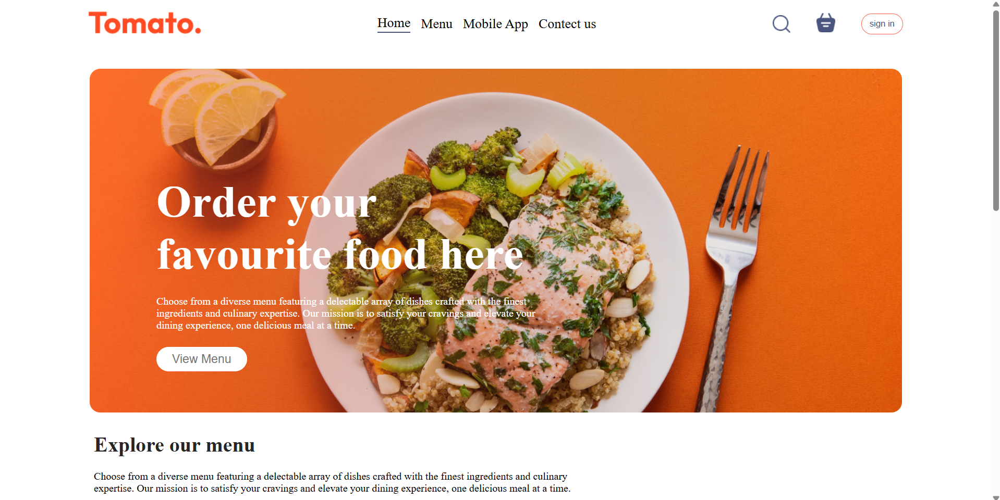
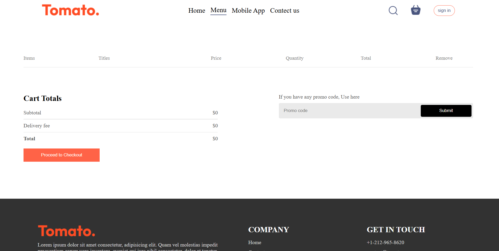

# 🍔 Food Delivery Platform

A modern full-stack food delivery web application built using the MERN stack with responsive UI, real-time cart updates, optimized backend APIs, and seamless user experience.

---

# 🚀 Features

* 🍕 Browse food categories and menu items
* 🛒 Real-time cart management
* 📦 Order placement system
* ⚡ Optimized React rendering
* 📱 Fully responsive UI
* 🔥 MongoDB optimized queries
* 🌐 REST API integration
* 🎯 Context API for global state management

---

# 🛠️ Tech Stack

## Frontend

* React.js
* CSS3
* JavaScript
* Context API

## Backend

* Node.js
* Express.js

## Database

* MongoDB

---

# 📸 Screenshots

## 🏠 Home Page



---

## 🍕 Food Menu


---

## 🛒 Cart Page



---

# ⚙️ Installation & Setup

## Clone Repository

```bash
git clone https://github.com/sparshdwivedi19/Food_Delivery_Web.git
```

---

## Frontend Setup

```bash
cd client
npm install
npm run dev
```

---

## Backend Setup

```bash
cd server
npm install
npm start
```

---

# 🔑 Environment Variables

Create a `.env` file inside the server folder:

```env
PORT=5000
MONGO_URI=your_mongodb_connection
JWT_SECRET=your_secret_key
```

---

# 📂 Project Structure

```bash
Food_Delivery_Web/
│
├── frontend/
│   ├── components/
│   ├── pages/
│   └── context/
│
├── backend/
│   ├── routes/
│   ├── models/
│   ├── controllers/
│   └── middleware/
│
└── screenshots/
```

---

# 📈 Performance Optimizations

* Reduced unnecessary React re-renders
* Optimized MongoDB query performance
* Efficient global state management using Context API

---

# 🌐 Future Improvements

* Online payment integration
* Authentication system
* Admin dashboard
* Live order tracking
* Recommendation engine

---

# 🤝 Contributing

Contributions are welcome! Feel free to fork the repository and submit pull requests.

---

# 📬 Contact

### 👨‍💻 Sparsh Dwivedi

* GitHub: https://github.com/sparshdwivedi19
* Portfolio: https://portfolio-sparsh-dwivedi.vercel.app

---

⭐ If you like this project, consider giving it a star!
